<div align="center">

# 🏥 MEDIConnect

### Plataforma de Gestão de Saúde Inteligente

*Combatendo o absenteísmo em clínicas e hospitais através de tecnologia e inovação*

[](https://nextjs.org/)
[](https://www.typescriptlang.org/)
[](https://react.dev/)
[](https://tailwindcss.com/)
[](https://supabase.com/)

</div>

---

## 📋 Índice

1. [Visão Geral](#-visão-geral)
2. [Problema e Solução](#-problema-e-solução)
3. [Funcionalidades](#-funcionalidades)
4. [Tecnologias](#️-tecnologias)
5. [Instalação](#-instalação)
6. [Como Usar](#-como-usar)
7. [Fluxos de Usuário](#-fluxos-de-usuário)
8. [Componentes Principais](#-componentes-principais)
9. [Contribuindo](#-contribuindo)
10. [Licença](#-licença)
11. [Contato](#-contato)

---

## 🎯 Visão Geral

**MEDIConnect** é uma plataforma web moderna e intuitiva desenvolvida para revolucionar a gestão de saúde em clínicas e hospitais. Com foco na redução do absenteísmo (faltas em consultas), a plataforma oferece uma experiência completa para pacientes, profissionais de saúde e administradores.

### 🌟 Diferenciais

- 🤖 **Zoe IA Assistant**: Assistente virtual inteligente para suporte aos usuários
- 📱 **Interface Responsiva**: Design moderno e adaptável a qualquer dispositivo
- 🔐 **Autenticação Segura**: Sistema robusto com perfis diferenciados
- ⚡ **Performance**: Construído com Next.js 15 para máxima velocidade
- 🎨 **UX/UI Premium**: Interface limpa e profissional voltada para área da saúde

---

## 🩺 Problema e Solução

### O Problema
O **absenteísmo** (não comparecimento a consultas agendadas) é um problema crítico em clínicas e hospitais, causando:
- ⏰ Desperdício de tempo dos profissionais
- 💰 Perda de receita para estabelecimentos
- 📉 Redução da eficiência operacional
- 😔 Impacto negativo no atendimento de outros pacientes

### Nossa Solução
MEDIConnect oferece um sistema inteligente de gestão que:
- ✅ Facilita o agendamento e reagendamento de consultas
- ✅ Permite visualização clara da agenda para profissionais
- ✅ Oferece assistência via IA para dúvidas e suporte

---

## ✨ Funcionalidades

### 👤 Para Pacientes
- 🏠 **Dashboard Personalizado**: Visão geral de consultas e exames
- 📅 **Agendamento**: Sistema fácil de marcar consultas
- 📋 **Resultados de Exames**: Acesso seguro a laudos e resultados
- 👨‍⚕️ **Busca de Profissionais**: Encontre médicos por especialidade
- 💬 **Zoe IA Assistant**: Tire dúvidas 24/7 com nossa assistente virtual

### 👨‍⚕️ Para Profissionais
- 📊 **Dashboard Profissional**: Visão completa de atendimentos
- ✍️ **Editor de Laudos**: Crie e edite laudos médicos de forma rápida
- 👥 **Gestão de Pacientes**: Acesse informações dos pacientes
- 📈 **Agenda**: Visualização clara de consultas

### 🔧 Para Administradores
- 📊 **Dashboard Administrativo**: Métricas e estatísticas em tempo real
- 📈 **Relatórios Detalhados**: Análise de comparecimento e absenteísmo
- 👥 **Gestão Completa**: Gerencie pacientes, profissionais e agendamentos
- 🎯 **Painel de Controle**: Visão 360° da operação da clínica

---

## 🛠️ Tecnologias

### Frontend (Atual)
- **[Next.js 15](https://nextjs.org/)** - Framework React com Server Components
- **[React 19](https://react.dev/)** - Biblioteca JavaScript para interfaces
- **[TypeScript](https://www.typescriptlang.org/)** - Tipagem estática para JavaScript
- **[Tailwind CSS](https://tailwindcss.com/)** - Framework CSS utilitário
- **[Shadcn/ui](https://ui.shadcn.com/)** - Componentes UI reutilizáveis
- **[React Hook Form](https://react-hook-form.com/)** - Gerenciamento de formulários
- **[Zod](https://zod.dev/)** - Validação de schemas
- **[date-fns](https://date-fns.org/)** - Manipulação de datas

### Backend (Integrado)
- **[Supabase](https://supabase.com/)** - Backend as a Service (PostgreSQL)
- **Authentication** - Sistema de autenticação completo
- **Storage** - Armazenamento de arquivos e documentos
- **REST API** - Endpoints integrados para todas as funcionalidades

### Ferramentas de Desenvolvimento
- **[ESLint](https://eslint.org/)** - Linter para código JavaScript/TypeScript
- **[PostCSS](https://postcss.org/)** - Transformação de CSS
- **[Autoprefixer](https://github.com/postcss/autoprefixer)** - Prefixos CSS automáticos

---

## 🚀 Instalação

### Pré-requisitos

Certifique-se de ter instalado:

- **Node.js** 18.17 ou superior
- **npm**
- **Git**

### Passo a Passo

1. **Clone o repositório**

```bash
git clone https://git.popcode.com.br/RiseUP/riseup-squad20.git
cd susconecta
```

2. **Instale as dependências**

```bash
npm install
```

3. **Configuração de ambiente (desenvolvimento)**

> Observação: o projeto possui valores _fallback_ em `susconecta/lib/env-config.ts`, mas o recomendado é criar um arquivo `.env.local` não versionado com suas credenciais locais.

```env
# Supabase
NEXT_PUBLIC_SUPABASE_URL=https://seu-projeto.supabase.co
NEXT_PUBLIC_SUPABASE_ANON_KEY=pk_... (anon key)

# Aplicação
NEXT_PUBLIC_APP_URL=http://localhost:3000
NEXT_PUBLIC_API_URL=http://localhost:3000/api
```

**Boas práticas de segurança**
- Nunca exponha a `service_role` key no frontend.
- Proteja operações sensíveis com Row-Level Security (RLS) no Supabase ou mova-as para rotas/Edge Functions server-side.
- Não commite `.env.local` no repositório (adicione ao `.gitignore`).

4. **Inicie o servidor de desenvolvimento**

```bash
npm run dev
```

5. **Acesse a aplicação**

Abra [http://localhost:3000](http://localhost:3000) no seu navegador.

---

## 💻 Como Usar

### Navegação Principal

#### 🏠 Página Inicial
Acesse `/home` para conhecer a plataforma e suas funcionalidades.

#### 🔐 Autenticação
O sistema possui três níveis de acesso:

- **Pacientes**: `/login-paciente`
- **Profissionais**: `/login-profissional`
- **Administradores**: `/login-admin`

#### 📱 Funcionalidades por Perfil

**Como Paciente:**
1. Faça login em `/login-paciente`
2. Acesse seu dashboard em `/paciente`
3. Agende consultas em `/consultas`
4. Visualize resultados em `/paciente/resultados`
5. Gerencie seu perfil em `/perfil`

**Como Profissional:**
1. Faça login em `/login-profissional`
2. Acesse seu dashboard em `/profissional`
3. Gerencie sua agenda em `/agenda`
4. Crie laudos em `/laudos-editor`
5. Visualize pacientes em `/pacientes`

**Como Administrador:**
1. Faça login em `/login-admin`
2. Acesse o painel em `/dashboard`
3. Visualize relatórios em `/dashboard/relatorios`
4. Gerencie o sistema completo

---

## 🎭 Fluxos de Usuário

### Fluxo de Agendamento (Paciente)

```mermaid
graph LR
A[Login Paciente] --> B[Dashboard]
B --> C[Buscar Médico]
C --> D[Selecionar Especialidade]
D --> E[Escolher Horário]
E --> F[Confirmar Agendamento]
F --> G[Receber Confirmação]
```



### Fluxo de Atendimento (Profissional)


### Fluxo Administrativo

```mermaid
graph LR
A[Login Admin] --> B[Dashboard]
B --> C[Visualizar Métricas]
C --> D[Gerar Relatórios]
D --> E[Analisar Absenteísmo]
E --> F[Tomar Decisões]
```



---

## 🧩 Componentes Principais

### 🤖 Zoe IA Assistant

Assistente virtual inteligente que oferece:
- Suporte 24/7 aos usuários
- Respostas a dúvidas frequentes
- Upload de arquivos para análise
- Interação por voz

**Arquivos:**
- `components/ZoeIA/ai-assistant-interface.tsx`
- `components/ZoeIA/voice-powered-orb.tsx`
- `components/ZoeIA/demo.tsx`

### 📅 Sistema de Agendamento

Gerenciamento completo de consultas e exames:
- Calendário interativo
- Seleção de horários disponíveis
- Confirmação automática
- Lembretes e notificações

**Arquivos:**
- `components/features/agendamento/`
- `components/features/Calendario/`
- `app/(main-routes)/consultas/`

### 📋 Editor de Laudos

Ferramenta profissional para criação de laudos médicos:
- Interface intuitiva
- Frases pré-definidas
- Exportação em PDF

**Arquivos:**
- `app/laudos-editor/`
- `lib/laudo-exemplos.ts`
- `lib/laudo-notification.ts`

### 📊 Dashboard Analytics

Painéis administrativos com:
- Métricas em tempo real
- Gráficos interativos
- Relatórios de absenteísmo
- Análise de desempenho

**Arquivos:**
- `components/features/dashboard/`
- `app/(main-routes)/dashboard/`
- `lib/reportService.ts`

---

## 🤝 Contribuindo

Contribuições são bem-vindas! Siga estes passos:

### 1. Fork o projeto

Clique no botão "Fork" no topo da página.

### 2. Clone seu fork

```bash
git clone https://git.popcode.com.br/RiseUP/riseup-squad20.git
cd susconecta
```

### 3. Crie uma branch

```bash
git checkout -b feature/nova-funcionalidade
```

### 4. Faça suas alterações

Desenvolva sua funcionalidade seguindo os padrões do projeto.

### 5. Commit suas mudanças

```bash
git add .
git commit -m "feat: adiciona nova funcionalidade X"
```

**Padrão de commits:**
- `feat:` Nova funcionalidade
- `fix:` Correção de bug
- `docs:` Documentação
- `style:` Formatação
- `refactor:` Refatoração
- `test:` Testes
- `chore:` Manutenção

### 6. Push para seu fork

```bash
git push origin feature/nova-funcionalidade
```

### 7. Abra um Pull Request

Descreva suas mudanças detalhadamente.

---

## 📝 Licença

Este projeto está sob a licença **MIT**. Veja o arquivo [LICENSE](LICENSE) para mais detalhes.

## 📞 Contato

**MEDIConnect Team**

- 🌐 Website: [mediconnect.com](https://mediconecta-app-liart.vercel.app/)
- 📧 Email dos Desenvolvedores:  
    - 📧 [Jonas Francisco](mailto:jonastom478@gmail.com)
    - 📧 [João Gustavo](mailto:jgcmendonca@gmail.com)
    - 📧 [Maria Gabrielly](mailto:maria.gabrielly221106@gmail.com)
    - 📧 [Pedro Gomes](mailto:pedrogomes5913@gmail.com)

---

<div align="center">

**Desenvolvido com ❤️ pelo squad 20**

*Transformando a gestão de saúde através da tecnologia*

[](https://nextjs.org/)

</div>